# Topological-Steering-Kernels

Topological-Steering-Kernels (TSK) is a four-phase experimental pipeline for detecting and mitigating looping behavior in autoregressive language model generation.

The repository uses **topological data analysis (TDA)** over hidden-state trajectories to:

1. collect and label generation windows,
2. extract persistence-based topological features,
3. test whether those features predict looping,
4. intervene at decoding time when looping risk is high.

---

## What this project does

Given prompts and GPT-2 hidden states, the pipeline builds a dataset of windows labeled as `looping` or `normal`, computes persistent homology features, and evaluates whether those features support the TSK hypothesis:

- **H1 (TSK model)**: topological features from hidden-state trajectories are predictive of loop behavior.
- **H0 (baseline)**: no meaningful topological signal beyond simpler controls.

If the hypothesis holds, Phase 4 applies a steering intervention to reduce repetition while preserving fluency.

---

## Repository layout

- `phase1.py` — Data collection, loop scoring, and labeling.
- `phase2.py` — Persistent homology feature extraction and exploratory plots.
- `phase3.py` — Statistical testing, classification, and model diagnostics.
- `phase4.py` — Topology-triggered decoding intervention and outcome analysis.

---

## Setup

```bash
pip install -r requirements.txt
```

Required packages are listed in `requirements.txt` and include:
`gudhi`, `transformers`, `torch`, `scikit-learn`, `matplotlib`, `seaborn`, `pandas`, `numpy`, `tqdm`, `scipy`.

---

## Run the full pipeline

Run phases in order from the repository root:

```bash
python phase1.py
python phase2.py
python phase3.py
python phase4.py
```

### Phase outputs

- **Phase 1**
  - `phase1-dataset.pkl`
  - `phase1-class-balance.png`
  - `phase1-loop-scores.png`
  - `phase1-hidden-norms.png`
- **Phase 2**
  - `phase2-features.csv`
  - `phase2-persistence-diagrams.png`
  - `phase2-barcodes.png`
  - `phase2-feature-distributions.png`
  - `phase2-correlations.png`
- **Phase 3**
  - `phase3-report.md`
  - `phase3-roc-curves.png`
  - `phase3-feature-importance.png`
  - `phase3-scatter.png`
  - `phase3-boxplots.png`
  - `phase3-confusion-matrix.png`
  - `phase3-calibration.png`
- **Phase 4**
  - `phase4-results.csv`
  - `phase4-completions.txt`
  - `phase4-summary.md`
  - `phase4-metric-comparison.png`
  - `phase4-per-prompt.png`
  - `phase4-intervention-timeline.png`
  - `phase4-suppressed-tokens.png`

---

## Figures

### Phase 1 — Data Collection & Loop Detection

**Window Class Balance**

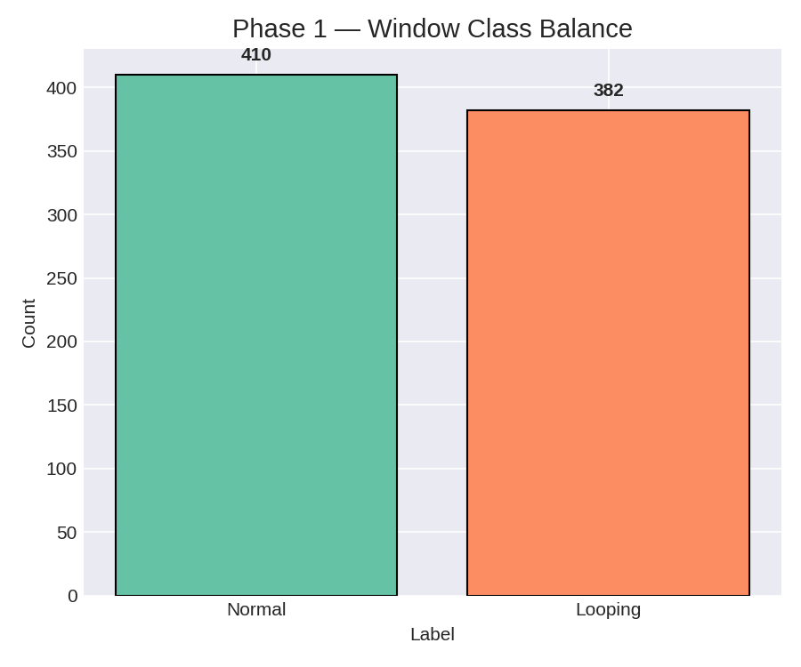

**Trigram Loop Score over Generation Steps**

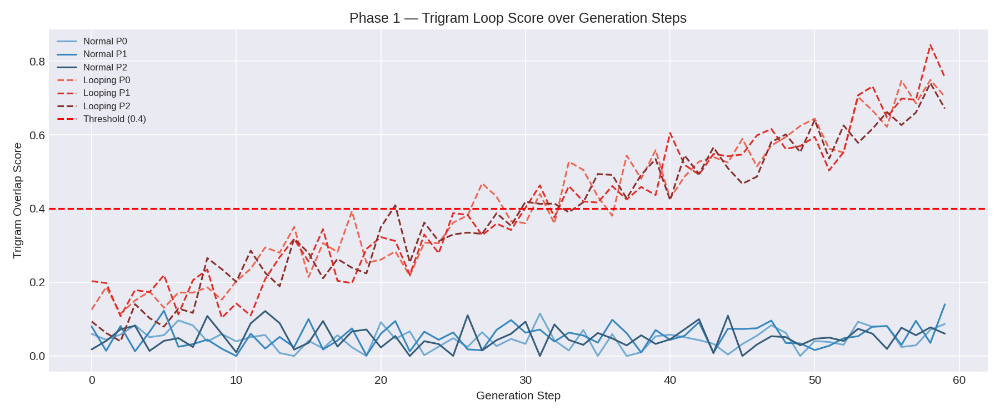

**Hidden-State L2 Norm Heatmap**

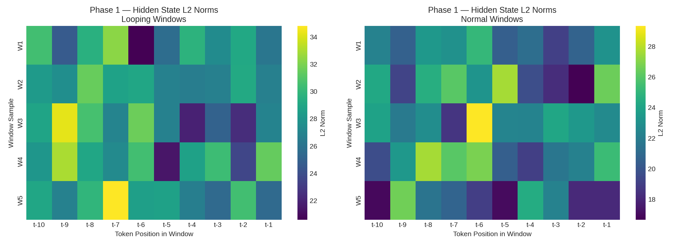

---

### Phase 2 — Topological Feature Extraction

**Persistence Diagrams**

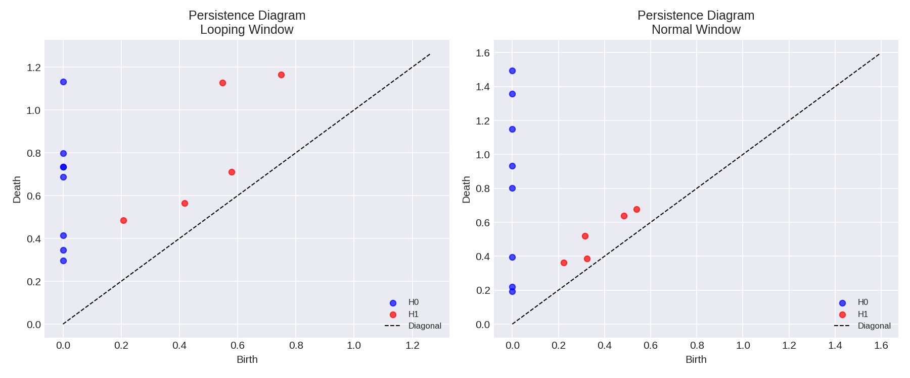

**Persistence Barcodes**

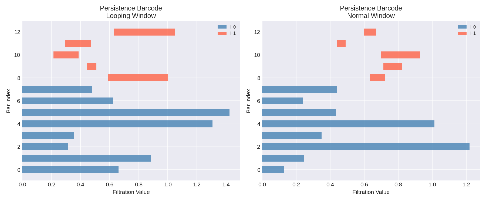

**H1 Feature Distributions**

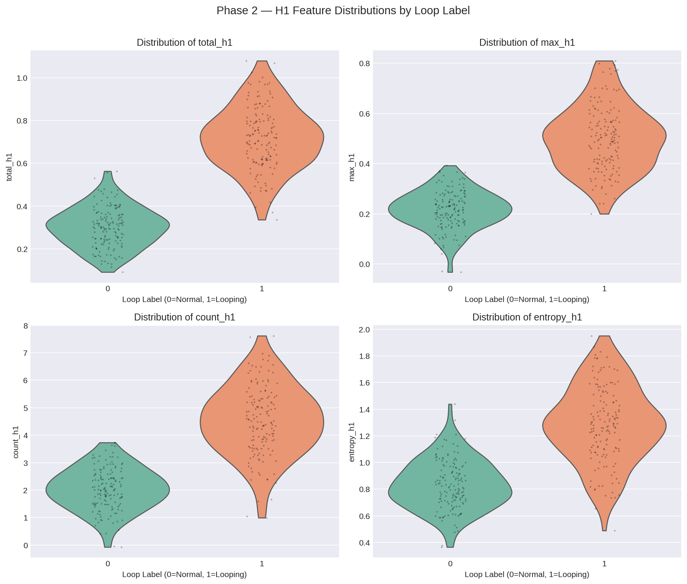

**Feature Correlation Matrix**

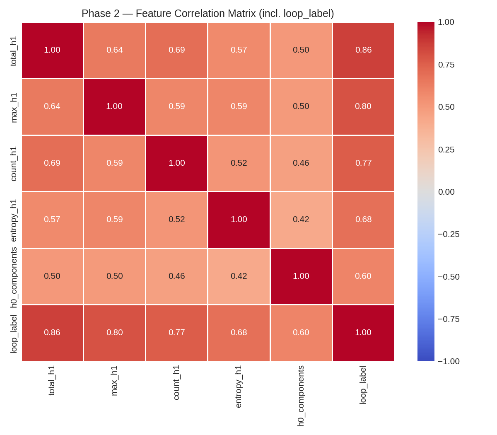

---

### Phase 3 — Statistical Validation

**ROC Curves**

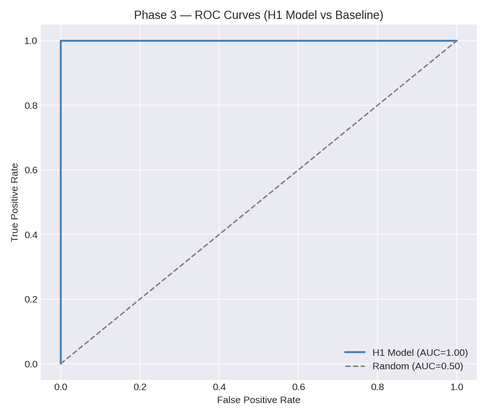

**Feature Importance (Logistic Regression Coefficients)**

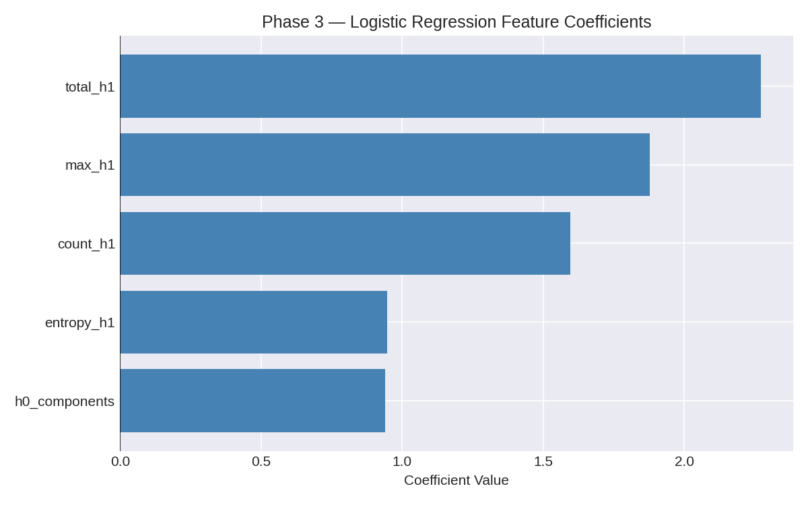

**total\_h1 vs max\_h1 Scatter**

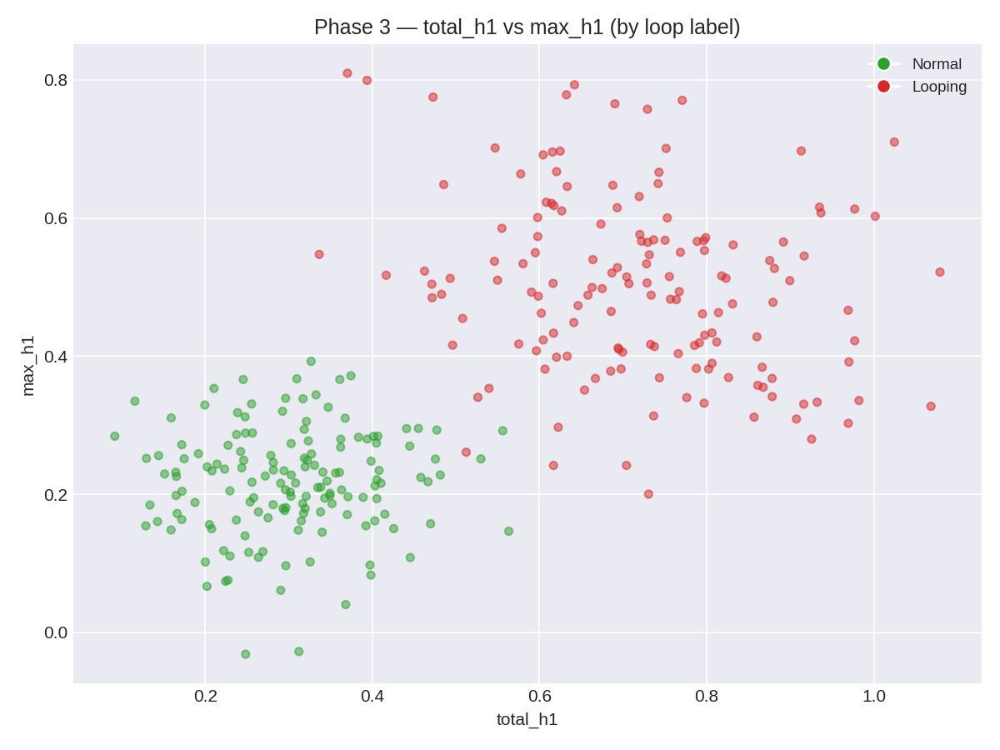

**Feature Boxplots**

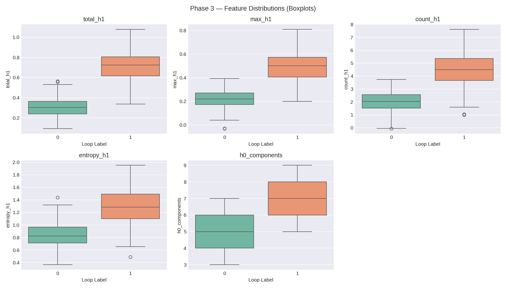

**Confusion Matrix**

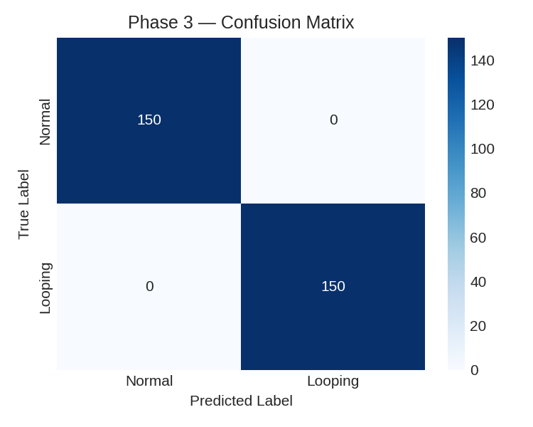

**Calibration Curve**

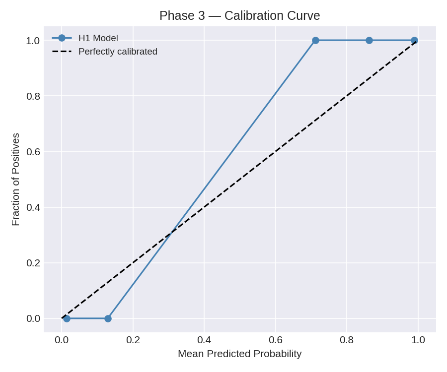

---

### Phase 4 — Topology-Triggered Decoding Intervention

**Metric Comparison (Repetition & Perplexity)**

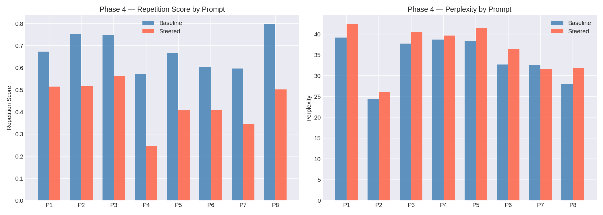

**Per-Prompt Repetition: Baseline vs Steered**

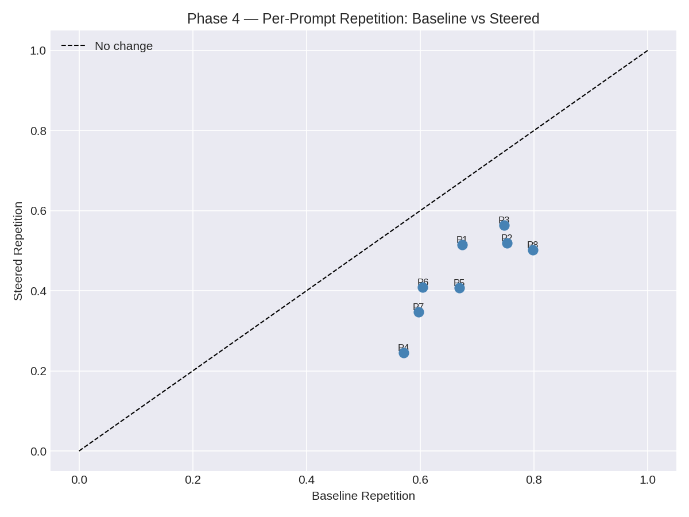

**Intervention Timeline**

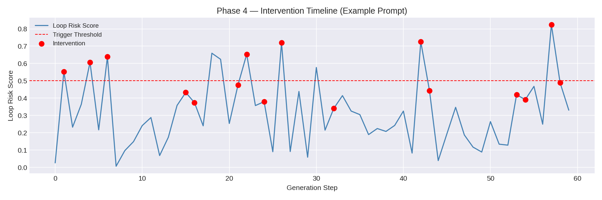

**Top Suppressed Tokens**

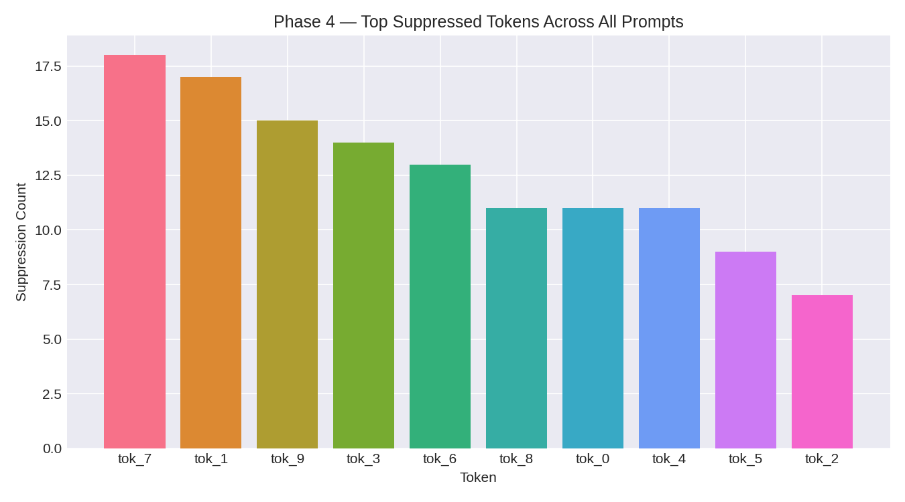

---

## Notes

- The project is designed as an experiment pipeline; run phases sequentially so that upstream artifacts are available downstream.
- The figures in the `figures/` directory are representative samples generated from synthetic data. Run the phase scripts to regenerate them from your own GPT-2 outputs.
